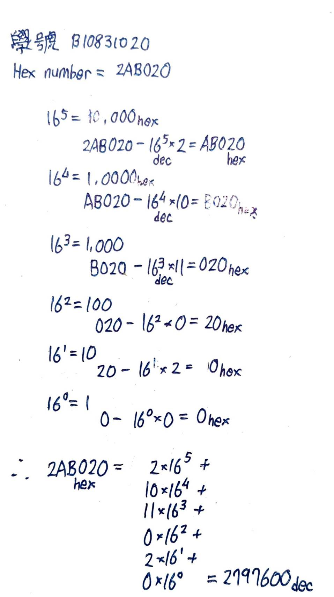

# HW0

|系級|學號|姓名|
|:---:|:---:|:---:|
|四機械四乙|B10831020|吳宇昕|

## Q1 Hex to Dec Algorithm

__C 程式碼__
```C  
int main()  
{
    char hex[17]; //配置17byte的記憶體空間存放使用者輸入的字串
    long long decimal = 0; //換算出的10進位的數值
    int i = 0, val, len; 
    /*
        val: 16進位數值裡，單一一個位數代表的值
        len: 使用者輸入的字串長度+1(終止字元)
        i: 走訪使用者輸入字串各個位數使用的index
    */
    printf("Enter any hexadecimal number: ");  
    gets(hex);  //接收使用者輸入
    len = strlen(hex) - 1;  //設此16進位數值的長度為字串長度-1(終止字元) 
    while(hex[i]!='\0')  //從此16進位數值的most significant digit走訪其各個位數(字元)
    {  
        /*
            ASCII('a') = 97
            ASCII('A') = 48
            ASCII('0') = 48
                若此字元介於0~9
                    其ASCII代號與ASCII('0')之差，即所代表的10進位值
                若此字元為小寫a~f
                    其ASCII代號與ASCII('a')之差+10，即所代表的10進位值
                若此字元為大寫A~F
                    其ASCII代號與ASCII('A')之差+10，即所代表的10進位值
        */
        if(hex[i]>='0' && hex[i]<='9'){  
            val = hex[i] - 48; 
        }else if(hex[i]>='a' && hex[i]<='f'){  
            val = hex[i] - 97 + 10;  
        }else if(hex[i]>='A' && hex[i]<='F'){  
            val = hex[i] - 65 + 10;  
        }
        //將此16進位數值字串的第i位乘上16的i次方，疊加至其代表的10進位數值
        decimal += val * pow(16, len - i); 
        i++; //前往16進位數字字串的less significant digit
    }
    printf("The decimal value is %d", decimal);
    return 0;
}
```

__Python程式碼__
```python
hexnum = input('輸入十六進位數字: ') #接收使用者輸入
decnum = 0 #換算出的十進位數值
"""
用reversed函式反轉使用者輸入的字串，使least significant digit在前，most significant digit在後

用enumerate函式一一列舉反轉字串中的各個位數(字元)
for迴圈每執行一次，變數digit會依序成為反轉字串的其中一個字元，變數power會成為該位數為第幾位
"""
for power, digit in enumerate(reversed(hexnum)):
    if digit.isdigit(): #若此字元是數字
        digit_num = int(digit) #直接將其轉為十進位整數0~9，得到該字元代表的十進位數值
    else: #若此字元為文字A~F
        digit_num = ord(digit.upper()) - ord('A') + 10 #將此字元一律轉為大寫字母後，求此字元的ASCII代號與ASCII("A")差距+10，得此字元代表的十進位值
    decnum += digit_num * (16 ** power) #將第power位字元代表的十進位數值乘上16的power次方，疊加至整個字串代表的十進位值

print('十進位結果:', decnum)
```

__比較__

Python程式碼用for迴圈搭配enumerate函式，比C程式碼簡潔得多。

兩分程式處理A~F字元的方式雷同，都是先求出該字元的ASCII代號，再算出該代號與ASCII('a')或ASCII("A")之差距，當作該字元代表10進位值。C語言的字元可以當作數值運算，各個字元的值默認為該字元的ASCII代號。而Python的字元，需要用```ord```函式明白地取得其ASCII代號值，才可以用一般整數的方式運算。

若要用極少的程式碼達到16進位數字轉10進位的效果，可以用Python的內建integer object constructor ```bar:int = int('1a2b3c', base = 16)```。

__學號換算__



## Q2 手動輸入三值

__終端機輸出__


[sorce code](CODE/Q2.py) and [replit](https://replit.com/join/qunzjqxzyg-b10831020)

這份Python script使用try-except語法，可以處理使用者輸入為非數值的情況。

既然題目未限定輸入各項運動時長的順序，可以使用dictionary儲存各項運動的時間長度。以運動名稱為key，其時間長度作為value形成的dictionay在取值時特別方便，且語法簡潔。